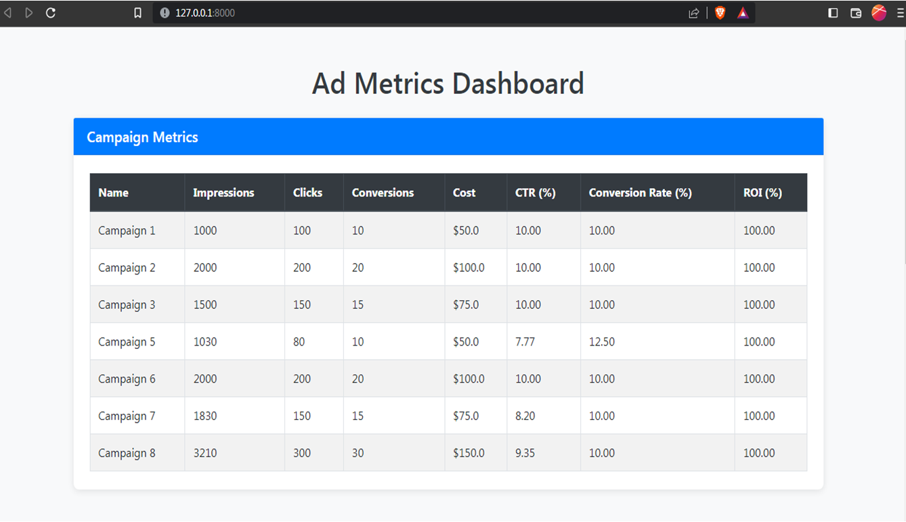
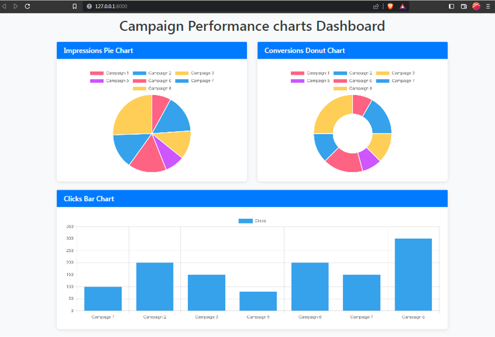

# 🎯 Ad Metrics Dashboard  

A web application built with **Django** to visualize and analyze ad campaign performance metrics such as CTR, conversion rates, and ROI. This dashboard provides interactive charts and insights to help businesses optimize their marketing strategies.

---

## 🌟 Features  
- **Interactive Dashboard**: Visualize ad campaign metrics with dynamic charts.  
- **Data Filtering**: Real-time filtering options for better insights.  
- **Load Dummy Data**: Preload sample data for quick demonstration using the `load_dummy_data` script.  
- **User-Friendly UI**: Clean and responsive interface powered by HTML, CSS, and Bootstrap.  

---

## Tech Stack  
- **Backend**: Django  
- **Frontend**: HTML, CSS, Bootstrap  
- **Database**: SQLite (default)  
- **Visualization**: Plotly  

---

## 🚀 Getting Started  

### 1. Clone the Repository  
```
git clone https://github.com/yourusername/ad-metrics-dashboard.git
cd ad-metrics-dashboard
```

### 2. Create a Virtual Environment and Install Dependencies  

Use the `requirements.txt` file to install all necessary packages:  

```
python -m venv venv
source venv/bin/activate  # On Windows: venv\Scripts\activate
pip install -r requirements.txt
```

### 3. Run Migrations  
```
python manage.py makemigrations
python manage.py migrate
```

### 4. Load Dummy Data (Optional)  
```
python load_dummy_data.py
```

### 5. Start the Development Server  
```
python manage.py runserver
```
Visit [http://127.0.0.1:8000](http://127.0.0.1:8000) to view the app in your browser.

---

## 📁 Project Structure  
```
ad-metrics-dashboard/
├── ad_dashboard/         # Core app containing views and models
    ├── static/            # Static files (CSS, JS, images)
        ├──css/
        └──js/
    ├── templates/         # HTML templates
    ├── mangement/
        ├── Commands
            └── load_dummy_data.py  # Script to load dummy data
├── manage.py          # Django management script
├── requirements.txt   # Python dependencies
└── README.md          # Project documentation
```

---

## 📊 Dummy Data  
The `load_dummy_data.py` script preloads sample campaign data for demonstration purposes. Use it to test the dashboard without external datasets.  

---

## Screenshots  
### Screenshots of your application.

> Dashboard Overview  
>   

> Metrics Visualization  
>    

---

## 📜 License  
This project is licensed under the MIT License. See the [LICENSE](LICENSE) file for details.

---

## 🤝 Contributing  
Contributions are welcome! Feel free to open issues or submit pull requests to improve the dashboard.  

---

## ✉️ Contact  
For any inquiries, feel free to reach out